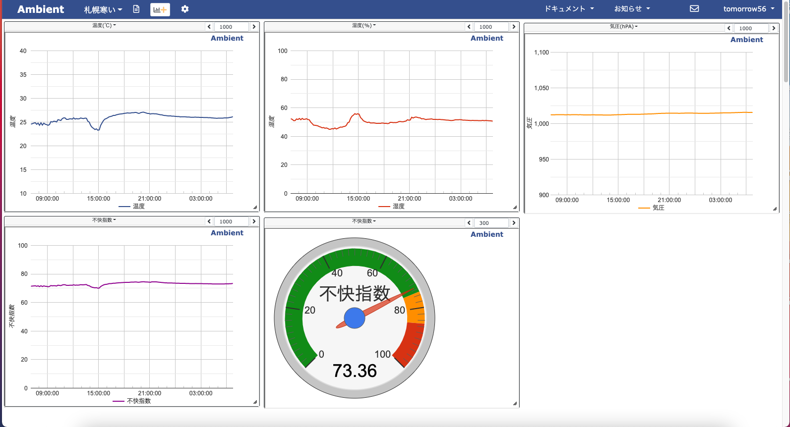

# M5Stack ENVII and III examples

## M5 disconfort-Index Meter (M5_ENVIII_ambient_task_example)
Calculate the disconfort-Index(Temperature-Humidity Index）, display screen (Analog Meter) and send data to ambient for making graphs.

